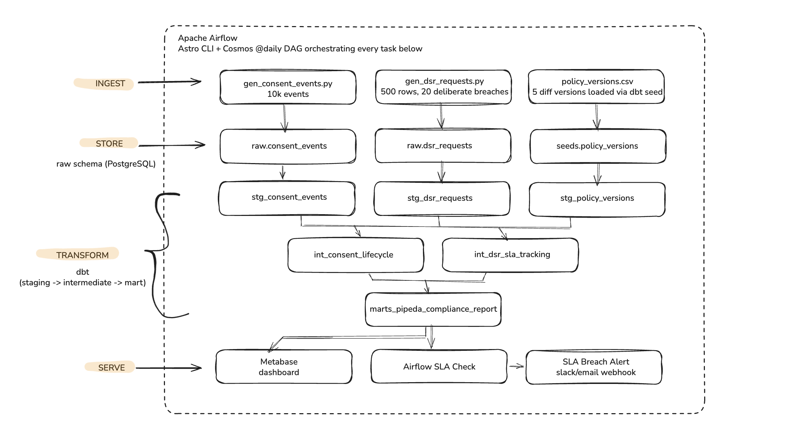
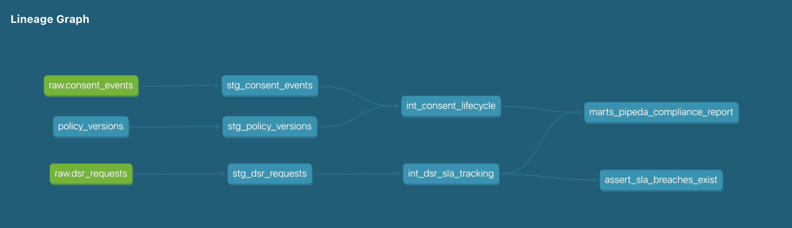
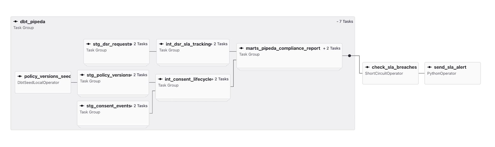
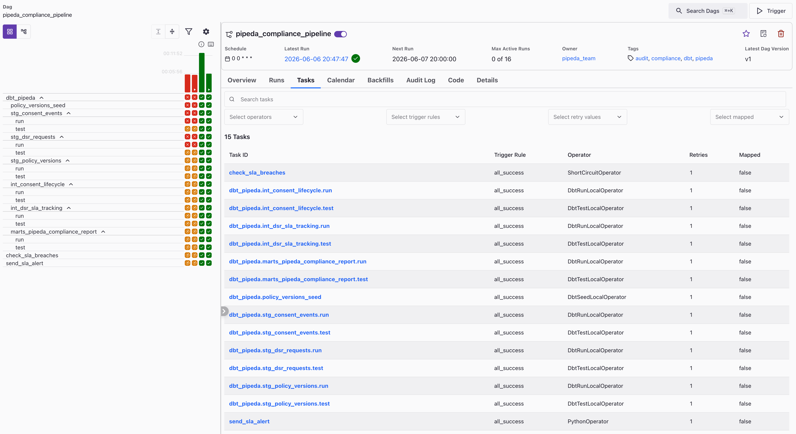
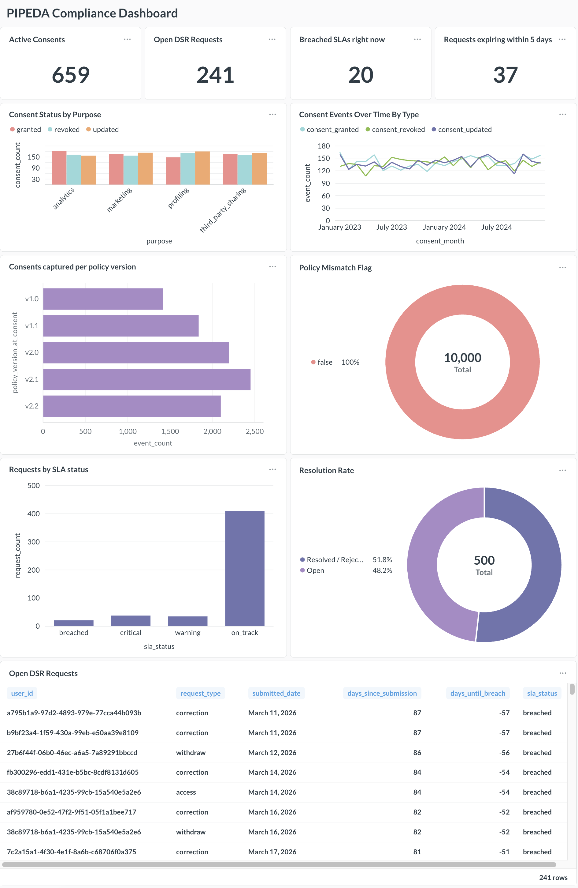

# PIPEDA Consent Audit Trail Pipeline

A daily data pipeline that tracks user consent and data subject requests (DSRs) under Canadian privacy law (PIPEDA). Built with Python, dbt, PostgreSQL, and Airflow.

---

## What this project is

When a user clicks "Accept" on a cookie banner or submits a privacy request, that's a legal event. Companies are required to track it, respond within deadlines, and prove compliance if a regulator asks. Most companies use consent management platforms (CMPs) for the collection side, but the audit and reporting side is a separate problem.

This project builds the downstream pipeline for that audit problem: raw consent events land in an append-only log, get cleaned and modelled through dbt layers, and a daily Airflow DAG checks for DSR requests that have exceeded the 30-day PIPEDA response deadline and surfaces them as alerts.

---

## Architecture



---

## Stack

| Layer | Tool |
|---|---|
| Storage | PostgreSQL 15 (Docker) |
| Transformation | dbt-core + dbt-postgres |
| Orchestration | Apache Airflow (Astro CLI) + Astronomer Cosmos |
| Synthetic data | Python, Faker, psycopg2 |
| Visualization | Metabase |

---

## Project structure

```
pipeda-pipeline/
├── scripts/
│   ├── gen_consent_events.py   #generates 10k consent events
│   └── gen_dsr_requests.py     #generates 500 DSR requests w/ 20 deliberate SLA breaches
├── pipeda_pipeline/
│   ├── seeds/
│   │   └── policy_versions.csv      #5 policy versions from 2023–2024
│   └── models/
│       ├── staging/
│       │   ├── stg_consent_events.sql
│       │   ├── stg_dsr_requests.sql
│       │   └── stg_policy_versions.sql
│       ├── intermediate/
│       │   ├── int_consent_lifecycle.sql
│       │   └── int_dsr_sla_tracking.sql
│       └── marts/
│           └── marts_pipeda_compliance_report.sql
├── pipeda_airflow/
│   └── dags/
│       └── pipeda_compliance_dag.py
│
└── .env                             # not committed
```

---

## Data model

**Raw schema** (`raw.*`)

Two append-only source tables. No updates and no deletes i.e. every row is a historical fact. `consent_events` is one row per user per purpose per event; if a user grants marketing consent and then revokes it, that's two rows.

**Staging layer** (`dbt_dev.stg_*`)

Materialised as views. Cleans and type-casts only, lowercasing strings, filtering bad values, extracting `days_since_submission` for DSR age. No business logic in this layer.

`stg_policy_versions` uses `LEAD()` to derive `valid_until` from the sequence of policy effective dates.

**Intermediate layer** (`dbt_dev.int_*`)

Materialised as tables. This is where the actual compliance logic lives.

- `int_consent_lifecycle`: joins every consent event to the policy version that was active *at the time of the event*, using a range join (`event_timestamp BETWEEN effective_date AND valid_until`). This is necessary because a user consenting in March 2023 was shown a different policy than one consenting in October 2023.
- `int_dsr_sla_tracking`: computes breach status, days until deadline, and urgency tier (on_track → warning → critical → breached) for every open DSR.

**Mart layer** (`dbt_dev.marts_*`)

One row per user per purpose. Joins the latest consent status per user per purpose with their DSR summary. This is the table a regulator would want to see.

---

## Design Notes

**Append-only raw tables**

Consent history should not be overwritten. If a user grants marketing consent in January and revokes it in March, both events matter. Keeping the raw tables append-only makes it possible to reconstruct consent state at any point in time.

**Policy version range join**

Although each consent event includes a `policy_version_id`, the pipeline also derives the active policy version from the event timestamp. This acts as a consistency check and reflects how historical policy changes are usually modelled.

**Cosmos for dbt orchestration**

I used Astronomer Cosmos instead of running `dbt build` as one shell command because Cosmos breaks dbt models into separate Airflow tasks. That makes failures easier to debug and gives better visibility into the pipeline.

---

## dbt lineage graph



---

## Running locally

**Prerequisites:** Docker Desktop, Python 3.11, Astro CLI

```bash
#1. Start Postgres
docker run --name pipeda-postgres \
  -e POSTGRES_PASSWORD=pipeda_dev \
  -e POSTGRES_USER=pipeda \
  -e POSTGRES_DB=pipeda_db \
  -p 5432:5432 \
  -v pipeda-postgres-data:/var/lib/postgresql/data \
  -d postgres:15

#2. Set up Python environment
python -m venv .venv && source .venv/bin/activate
pip install psycopg2-binary faker python-dotenv dbt-core dbt-postgres

#3. Create .env (fill in values)

#4. Create the raw schema and tables

# Open sql/init_raw_schema.sql file in DBeaver (or any other SQL client) and run it against `pipeda_db`. This will create the raw schema and both the source tables.


#5. Generate synthetic data
python scripts/gen_consent_events.py
python scripts/gen_dsr_requests.py

#6. Run dbt
cd pipeda_pipeline
dbt seed && dbt build

#7. Configure Airflow
# Before starting Airflow, open `pipeda-airflow/docker-compose.override.yml` and update the volume mount path to point to your local `pipeda_pipeline/` directory.

#Then start Airflow:

cd ../pipeda_airflow
astro dev start


# Once it's running, go to the Airflow UI, and add a Postgres connection:
# Admin → Connections → +  
# Connection ID: pipeda_postgres  
# Host: host.docker.internal  
# Schema: pipeda_db  
# Login: pipeda  
# Password: pipeda_dev  
# Port: 5432
```

Airflow UI: `http://localhost:8080`  
Metabase: `http://localhost:3000`

---

## Airflow DAG






The DAG runs daily. Task order: raw data ingestion → dbt models → SLA breach check → alert. 

The breach check uses a `ShortCircuitOperator` : if no breaches exist, the alert task is skipped cleanly rather than failing.


---

## Metabase dashboard



---

## Data quality

dbt tests run at every layer:

- **Staging**: `not_null`, `unique`, `accepted_values` on all key columns
- **Intermediate**: uniqueness on `event_id` and `request_id`, accepted values on `sla_status`
- **Mart**: grain-level uniqueness test on `user_id || purpose` combination
- **Custom test**: `assert_sla_breaches_exist.sql` — confirms the pipeline is actually surfacing breaches, not silently returning zero rows

---

## What's synthetic and why

The project uses generated data so the pipeline can be run locally without exposing real user information.

I intentionally included:
- 10,000 consent events across multiple purposes
- 500 DSR requests
- 20 deliberate SLA breaches
- five policy versions across 2023–2024

This made it easier to test whether the dbt models, range joins, SLA logic, and dashboard were working correctly.

---

## Next Improvements

- PII column-level lineage so you can trace exactly which fields contain personal data at each stage
- Identity provider integration (the `user_id` here is a UUID; in production it would resolve to an identity in your IDP)
- Regulator-ready PDF export from the mart layer: one click to a structured compliance report
- Alerting via Slack webhook instead of Airflow logs